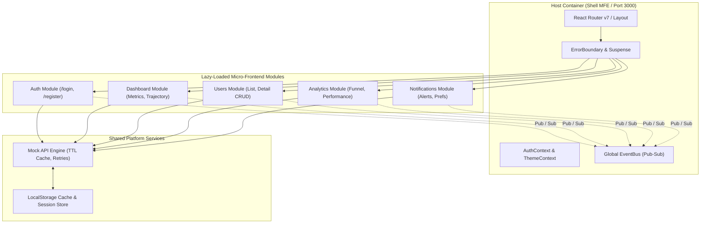

# Enterprise Micro-Frontend Dashboard

An enterprise-grade, high-performance Micro-Frontend (MFE) Dashboard built with **React 18**, **Vite**, **Tailwind CSS v4**, and **Lucide React**. 

This application demonstrates a production-ready **Shell/Host + Micro-Frontend Sub-Application Architecture**, featuring dynamic code-splitting, custom pub-sub event-bus communication, resilience via Error Boundaries, rich interactive telemetry, and a sophisticated Mock API service with TTL caching, retry exponential backoff, and offline persistence.

---

## 🏗️ Architecture Overview



---

## ⚡ Quick Start & Installation

### Prerequisites
- **Node.js**: `v18.0.0` or higher
- **npm**: `v9.0.0` or higher

### 1. Installation
Clone the repository and install all dependencies:
```bash
git clone <repository-url>
cd "Micro-Frontend Dashboard"
npm install
```

### 2. Development Mode
Launch the development server on `http://localhost:3000`:
```bash
npm run dev
```

### 3. Production Build & Preview
Validate production bundle generation and code splitting:
```bash
npm run build
npm run preview
```

---

## 🧩 Micro-Frontend Integration Details

### 1. Host / Shell Pattern
The Shell (`src/App.jsx`) acts as the orchestration layer:
- **Routing & Navigation**: Centralized route distribution using `react-router-dom`.
- **Module Boundaries**: Wraps each dynamically imported module in `React.Suspense` with custom fallback loaders and `ErrorBoundary` components to ensure single-module isolation (a crash in one MFE does not bring down the Shell or sister MFEs).
- **Global Layout**: Provides unified Sidebar navigation, Top Navbar, Command Palette (`Ctrl+K`), and MFE Architecture DevTools.

### 2. Module Directory Structure
Each domain module is completely self-contained within `src/modules/`:
```
src/
├── modules/
│   ├── auth/            # Authentication & SSO MFE
│   │   ├── components/  # Module-specific UI components
│   │   ├── pages/       # LoginPage, RegisterPage
│   │   └── index.jsx    # MFE Public API Contract
│   ├── dashboard/       # Main Executive Overview MFE
│   ├── users/           # User Management & Directory MFE
│   ├── analytics/       # Deep Telemetry & Performance MFE
│   └── notifications/   # Real-Time Event & Alert MFE
└── shared/              # Cross-MFE Platform Utilities
    ├── components/      # UI Design System (Navbar, Sidebar, Modal, etc.)
    ├── context/         # AuthContext, ThemeContext
    ├── hooks/           # useAuth, useDebounce, useNetwork
    ├── services/        # eventBus.js, api.js
    └── utils/           # Formatters, Validation helpers
```

---

## 📡 Cross-Module Communication Model

Modules are fully decoupled and communicate asynchronously via the **Global Event Bus** (`src/shared/services/eventBus.js`).

### Event Bus Mechanics
- **Custom Event Dispatching**: Built on native browser `CustomEvent` primitives for lightweight execution without extra dependencies.
- **Audit Logging**: Keeps an in-memory sliding buffer of the last 80 emitted events for live inspection in the built-in DevTools Drawer.
- **State Replay Caching**: Allows late-mounting micro-frontends to subscribe to slice state and instantly receive the current state upon mounting.

### Key Micro-Frontend Events (`MFE_EVENTS`)
| Event Name | Description | Triggered By | Subscribed By |
| :--- | :--- | :--- | :--- |
| `mfe:auth-changed` | Emitted on user login, logout, or session expiry | Auth MFE | Shell, Navbar, Notifications |
| `mfe:user-mutated` | Emitted when user records are added, modified, or deleted | Users MFE | Dashboard MFE, DevTools |
| `mfe:notification-emit` | Broadcasts new system/security alerts | Any MFE | Notifications MFE, Navbar |
| `mfe:network-status-changed` | Network online/offline transition notice | Network Hook | Shell, API Layer |
| `mfe:navigate` | Imperative cross-module route navigation | Command Palette / MFEs | Shell Router |

---

## 🌐 API Integration Layer

The API service (`src/shared/services/api.js`) provides a simulated REST API engine:

### Features & Capabilities
1. **Mock JWT Authentication**: Real token generation (`Base64` standard format), token decode, expiration tracking (30-minute expiry), and automatic refresh token mechanics.
2. **In-Memory TTL Caching**:
   - GET requests are cached with dynamic TTLs (e.g., 30 seconds for users, 15 seconds for analytics).
   - Automatically invalidates cache tags on write operations (`POST`, `PUT`, `DELETE`).
3. **Promise Deduplication**: Identical in-flight asynchronous requests are merged into a single promise to eliminate redundant network overhead.
4. **Resilience & Retry Policies**: Exponential backoff with random jitter retries failed requests automatically up to 3 times before raising errors.
5. **Offline Mode & Storage Persistence**: Syncs state to `localStorage` (`mfe_data_users`, `mfe_data_notifications`), enabling seamless offline operation when network disconnects occur.
6. **Failure Mode & Latency Simulation**: Toggle simulated network latency (200ms - 2000ms) and artificial 500 server errors via the DevTools Drawer to test frontend error handling resilience.

---

## 🔍 Verification & Demo Accounts

### Demo Login Credentials
- **Admin Access**: `sarah.chen@enterprise.io` / `password123`
- **Manager Access**: `marcus.vance@enterprise.io` / `password123`
- **Viewer Access**: `elena.rostova@enterprise.io` / `password123`

### Key Features to Test
1. **Micro-Frontend Lazy Loading**: Observe chunk loading when navigating between Dashboard, User Directory, Analytics, and Notifications.
2. **Event Bus Telemetry**: Click "Inspect Event Bus" in the top navbar or footer to open the DevTools Drawer. Trigger user creation or notification clearing to view real-time event logs.
3. **Command Palette**: Press `Ctrl + K` (or `Cmd + K`) anywhere in the application to perform instant cross-module navigation or user searches.
4. **Offline Mode**: Disconnect network connection or switch browser offline status to inspect fallback cache handling and warning banner.
